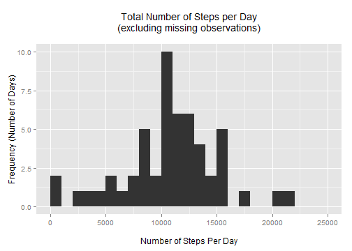
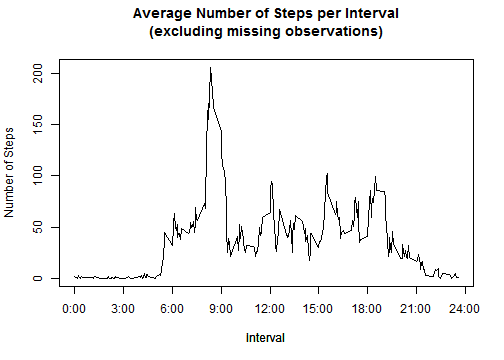
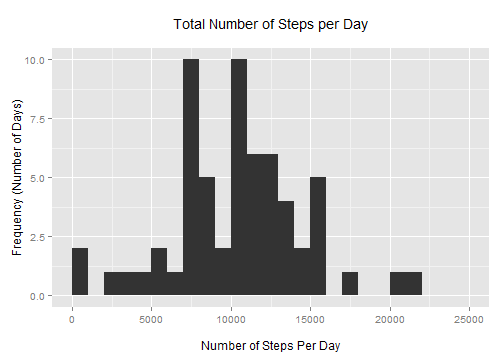
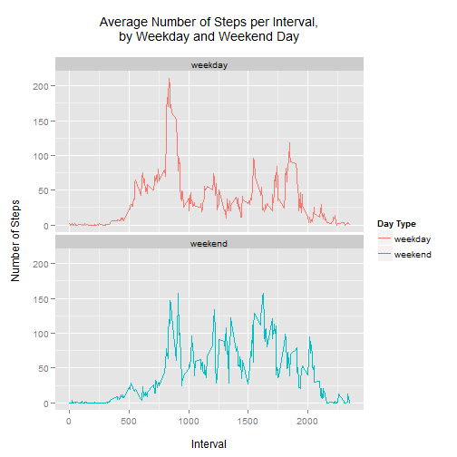

Personal Activity Monitoring Device - Data Analysis
===================================================

## Introduction

(From the assignment) It is now possible to collect a large amount of data about 
personal movement using activity monitoring devices such as a Fitbit, Nike 
Fuelband, or Jawbone Up. These type of devices are part of the "quantified self" 
movement - a group of enthusiasts who take measurements about themselves 
regularly to improve their health, to find patterns in their behavior, or 
because they are tech geeks. But these data remain under-utilized both because 
the raw data are hard to obtain and there is a lack of statistical methods and 
software for processing and interpreting the data.

## Loading and preprocessing the data

This personal activity monitoring device collects data at 5 minute intervals 
throughout the day. The data consists of two months of data from an anonymous 
individual collected during the months of October and November 2012, and include 
the number of steps taken in 5 minute intervals each day.

The variables included in this dataset are:

- steps: Number of steps taken in a 5-minute interval (missing values are coded 
as NA)
- date: The date on which the measurement was taken, in YYYY-MM-DD format
- interval: Identifier for the 5-minute interval in which measurement was taken. 
This can be read like a 24-hour clock; "0" is midnight, "945" is 9:45 A.M., and 
"2015" is 8:15 P.M.

The dataset is stored in a comma-separated-value (CSV) file and there are a 
total of 17,568 observations in this dataset. <a href = "https://d396qusza40orc.cloudfront.net/repdata%2Fdata%2Factivity.zip">Link to the data</a>.


```r
data = read.csv('./activity.csv', header=T)
```

Create a second data frame for the data with the missing observations (steps=NA) 
removed.


```r
dataWithoutNA <- data[complete.cases(data),]
```

## What is mean total number of steps taken per day?

Using the data without the missing observations, let's make a histogram of the 
total number of steps taken each day, and calculate the mean and median total number of steps taken per day.


```r
stepsByDay = aggregate(steps ~ date, data=dataWithoutNA, FUN=sum)
library(ggplot2)
qplot(stepsByDay$steps, 
      binwidth=1000,
      main="Total Number of Steps per Day\n(excluding missing observations)\n",
      xlab="\nNumber of Steps Per Day", 
      ylab="Frequency (Number of Days)",
      xlim=c(0,25000))
```

 

```r
options(scipen=5) # needed to prevent scientific notation in RMarkdown
meanStepsPerDay = round(mean(stepsByDay$steps,na.rm=T),1)
medianStepsPerDay = median(stepsByDay$steps,na.rm=T)
```

The mean number of steps each day is 10766.2, and the median number 
of steps per day is 10765.

## What is the average daily activity pattern?

Continuing to only use the data without the missing observations, let's look at
how the number of steps behaves interval by interval, averaged over all days. 
Let's make a time series plot of the average (over all days) number of steps 
taken per 5-minute interval.


```r
averageSteps = as.vector(tapply(dataWithoutNA$steps, 
                                       dataWithoutNA$interval, mean, simplify=T))
intervalStepAverage = data.frame(interval=data$interval[1:288], avgSteps=averageSteps)
plot(intervalStepAverage, 
     type="l",
     xaxt="n",
     ylab="Number of Steps")
axis(1, labels=c('0:00','3:00','6:00','9:00','12:00','15:00','18:00','21:00','24:00'), 
     at=c(0, 300, 600, 900, 1200, 1500, 1800, 2100, 2400))
title("Average Number of Steps per Interval\n(excluding missing observations)\n",
      xlab="Interval")
```

 


```r
maxAvgStepRow = which.max(intervalStepAverage$avgSteps)
maxAvgStepInterval = intervalStepAverage$interval[maxAvgStepRow]
maxAvgStepCount = round(intervalStepAverage$avgSteps[maxAvgStepRow],1)
```

The 5-minute interval that have the largest average number of steps over all 
days is 835, with 206.2 steps.

## Imputing missing values


```r
missingObservations = nrow(data) - nrow(dataWithoutNA)
```

The number of observations that are missing data is 2304.

In a new data frame, We will fill in all the missing data points (the NAs) by
inserting the average number of steps over all days for the corresponding 
interval. We'll also display the updated histogram showing the distribution of 
the total number of steps each day.


```r
newData = data
naRows = which(is.na(data$steps))
for (i in naRows) { newData[i,1] = averageSteps[(newData[i,3]/5)+1]}
newDataByDay = aggregate(steps ~ date, data=newData, FUN=sum)
qplot(newDataByDay$steps, 
      binwidth=1000,
      main="Total Number of Steps per Day\n",
      xlab="\nNumber of Steps Per Day",
      ylab="Frequency (Number of Days)",
      xlim=c(0,25000))
```

 

```r
newMeanByDay = round(mean(newDataByDay$steps),1)
newMedianByDay = median(newDataByDay$steps)
```

The new mean number of steps taken each day is 10282.1, and the new 
median number of steps taken each day is 10395.

Using our scheme to fill in the missing data, the mean number of steps per day 
decreased by 484.1, and the median decreased by 
370. This is a relatively insignificant 
change.

## Are there differences in activity patterns between weekdays and weekends?

In the data frame containing the data with the missing observations
filled in, let's indicate which days are weekdays, and which are weekend days. 
We'll make a two-panel plot with the time series of observations of average steps,
split into weekend days and weekdays, to see how the data varies.


```r
newData$day = weekdays(as.Date(newData$date))
dayLevels = levels(factor(newData$day))
newData$dayType = "weekday"
newData$dayType[newData$day == "Saturday" | newData$day == "Sunday"] = "weekend"
newData$dayType = as.factor(newData$dayType)
library(plyr)
averageStepsByDayType = ddply(newData, .(interval, dayType), 
                              summarize, steps=mean(steps,na.rm=TRUE))
ggplot(data=averageStepsByDayType, 
       aes(x=interval, y=steps, group=dayType)) + 
       geom_line(aes(color=dayType)) +
       xlab("\nInterval") +
       ylab("Number of Steps\n") +
       ggtitle("Average Number of Steps per Interval,\nby Weekday and Weekend Day\n") +
       facet_wrap(~ dayType, nrow=2) +
       scale_colour_discrete("Day Type")
```

 

We can see a few trends from the plots:
- People are starting to move later in the day on weekends.
- During weekdays, there are a lot of steps taken when people are typically 
leaving for school or work.
- In the middle of the day, activity is lower during weekdays than it is on 
weekends; this reflects active weekends versus being seated at school or work.
- Activity is low overnight, when most people sleep.
